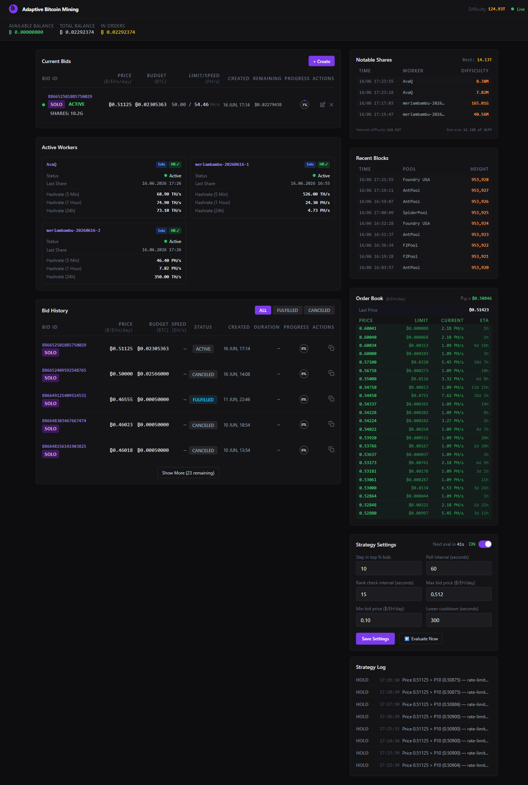
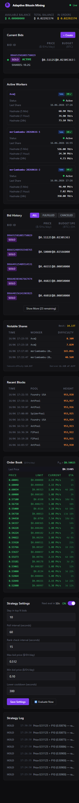

# Adaptive Bitcoin Solo Mining — Braiins Hash Power Bot

An open-source adaptive bidding bot and real-time dashboard for the [Braiins Hash Power](https://hashpower.braiins.com) marketplace. It automatically adjusts your bid price to stay in the cheapest **top-N** bids in the order book, maximising hashrate received while minimising cost.

> **Order creation is always manual** — the bot only adjusts prices on orders you've already placed. You remain in full control of your budget.

---

## Screenshots

| Desktop | Mobile |
|:---:|:---:|
|  |  |

---

## Features

- **Adaptive bidding** — pure P_N tracking from the live order book: raises to P_N when below, lowers to P_N when above, holds when equal. No guesses, no arbitrary offsets — the market sets the price
- **Hard price rails** — never bids above `MAX_BID_PRICE` or below `MIN_BID_PRICE`
- **Real-time dashboard** — Vue 3 + Tailwind dark UI with live WebSocket updates
- **Order book** — bids in green, asks in red, spread bar; your position auto-highlighted
- **Active worker cards** — per-bid hashrate breakdown (5 min / 1 hr / 24 h from snapshot history)
- **Notable shares log** — live feed from Braiins Solo Pool with difficulty progress vs network target
- **Recent blocks** — live feed of the 10 most recently solved BTC blocks network-wide (height + mining pool) from mempool.space
- **BTC network difficulty** — live in the header, auto-refreshes every 5 minutes
- **Block celebration** — full-screen overlay + audio when a block is solved (see [Audio](#audio))
- **Strategy log** — full audit trail of every RAISE / LOWER / HOLD / IDLE decision
- **Always-on scheduler** — APScheduler full cycle + fast raise-only rank check
- **Manual trigger** — run a strategy evaluation instantly from the dashboard
- **Open source & secure** — credentials live only in `.env`, never logged or committed

---

## Architecture

```
┌─────────────────────────────────────────┐
│            Vue 3 Frontend               │
│  BidsTable · MarketOverview · Strategy  │
│         Panel · CreateBidModal          │
└──────────────┬──────────────────────────┘
               │  HTTP REST + WebSocket
┌──────────────▼──────────────────────────┐
│           FastAPI Backend               │
│  /api/orders  /api/market  /api/settings│
│  /api/strategy   /ws (WebSocket)        │
│  APScheduler → adaptive strategy loop  │
└──────────────┬──────────────────────────┘
               │  apikey header (lowercase)
┌──────────────▼──────────────────────────┐
│     Braiins Hash Power REST API         │
│   hashpower.braiins.com/webapi/…        │
└─────────────────────────────────────────┘
          │
     SQLite DB (strategy logs + snapshots)
```

---

## Quick Start

### Prerequisites

- Python 3.12+
- Node.js 20+
- A Braiins Hash Power account with API keys

### 1 — Clone & configure

```bash
git clone https://github.com/meriambambu/Adaptive-Solo-Bitcoin-Mining-Strategy.git
cd Adaptive-Solo-Bitcoin-Mining-Strategy

# Copy and fill in your credentials
cp backend/.env.example backend/.env
```

Edit `backend/.env` — see [Configuration](#configuration) below.

### 2 — Start the backend

```bash
cd backend
python -m venv .venv
# Windows:
.venv\Scripts\activate
# macOS/Linux:
source .venv/bin/activate

pip install -r requirements.txt
uvicorn app.main:app --reload
```

Backend runs at `http://localhost:8000`. Swagger docs at `http://localhost:8000/docs`.

### 3 — Start the frontend

```bash
cd frontend
npm install
npm run dev
```

Dashboard opens at `http://localhost:5173`.

---

## Configuration

All settings live in `backend/.env` (never committed). Copy from `backend/.env.example`.

### Getting Your API Key

1. Log in to [hashpower.braiins.com](https://hashpower.braiins.com)
2. Go to **Account → Settings → API Keys → Generate New Key**
3. Copy the single API key value into `BRAIINS_API_KEY` in `backend/.env`
4. If you get 401 errors, open `hashpower.braiins.com/api/` → Authorize → run a test request → check the Network tab to confirm the exact header name

### Strategy Parameters

| Variable | Default | Description |
|---|---|---|
| `TOP_N` | `5` | Target rank — P_N is the Nth cheapest matched bid; the bot tracks this price |
| `MAX_BID_PRICE` | `0.60` | Hard ceiling — never bid above this (BTC/EH/day) |
| `MIN_BID_PRICE` | `0.10` | Floor — never bid below this |
| `LOWER_COOLDOWN` | `300` | Seconds between LOWER edits per bid (Braiins API rate-limit guard) |
| `POLL_INTERVAL` | `60` | Seconds between full cycles (minimum 30) |
| `RANK_CHECK_INTERVAL` | `15` | Seconds between fast raise-only checks (minimum 10) |
| `STRATEGY_ENABLED` | `true` | Master on/off switch |

All parameters are also editable live from the **Strategy Settings** panel in the dashboard without restarting.

> The strategy is **data-driven, not speculative.** There are no tunable "buffer" or "step"
> offsets — the order book's P_N *is* the target price. Your only levers are which rank to
> target (`TOP_N`) and the hard safety rails (`MIN`/`MAX_BID_PRICE`).

### Pool Setup

For Braiins Solo mining, use:

```
Pool URL:  public.stratum.braiins.com
Port:      3333
Username:  your_bitcoin_address.worker_name
```

Also set `SOLO_WALLET` in `.env` to your BTC payout address so the dashboard can fetch your notable shares and pool stats from `solo.braiins.com`. This value is used **server-side only** and is never returned by any API endpoint.

---

## Audio

When a block is solved (share difficulty ≥ network difficulty), the dashboard plays a celebration sound.

**The audio file is copyrighted and is not included in this repository.**

### To enable full audio:

1. Obtain a legal copy of your preferred celebration track (e.g. *We Are the Champions* by Queen).
2. Name the file `champions.mp3`.
3. Place it at `frontend/public/champions.mp3`.

```
frontend/
└── public/
    └── champions.mp3   ← place here manually
```

> `frontend/public/*.mp3` is listed in `.gitignore` and will **never** be committed.

If the file is absent the dashboard automatically falls back to a synthesised melody via the Web Audio API — no file is required for the fallback.

---

## How the Strategy Works

```
Every POLL_INTERVAL seconds:

1. Fetch your active orders from Braiins API
   └─ If none → log IDLE, skip (no auto-create)

2. Fetch public order book; keep bids with real hashrate (hr_matched_ph > 0),
   sort by price ASC  (falls back to the full book if none are matched)

3. P_N = price of the Nth cheapest matched bid

4. For each active order:
   ┌─ my_price > MAX_BID_PRICE?
   │  └─ LOWER to MAX_BID_PRICE (hard cap)
   ├─ my_price < P_N?
   │  └─ RAISE to min(P_N, MAX_BID_PRICE)
   ├─ my_price > P_N?
   │  └─ LOWER to max(P_N, MIN_BID_PRICE)   (skipped if within LOWER_COOLDOWN)
   └─ my_price == P_N → HOLD

5. Log decision → SQLite
6. Broadcast to all dashboard WebSocket clients
```

A separate fast check runs every `RANK_CHECK_INTERVAL` seconds and only *raises* bids that
have fallen below P_N — so you climb back into rank quickly without waiting for the full cycle.

```text
The price target is always exactly P_N — never a guessed offset above or below it.
```

### What the bot does NOT do

- **Does not auto-create orders** — the strategy only adjusts prices on existing bids; create new orders yourself with the dashboard's **+ Create** button
- **Does not cancel orders** — use the dashboard's cancel (×) button
- **Does not manage budget** — you set the BTC amount when creating an order
- **Does not raise beyond MAX_BID_PRICE** — ever

---

## Dashboard

| Panel | Description |
|---|---|
| **Current Bids** | Live table of your orders: price, budget, speed, progress ring |
| **Active Workers** | Per-bid cards with 5-min / 1-hr / 24-hr hashrate from snapshot history |
| **Bid History** | Fulfilled / cancelled order history with filter tabs |
| **Order Book** | Bids (green) + asks (red) with spread bar; your bids highlighted purple |
| **Strategy Settings** | Edit all parameters live; enable/disable; manual trigger |
| **Strategy Log** | Timestamped log of every RAISE / LOWER / HOLD / IDLE decision |
| **Notable Shares** | Solo pool notable share feed with difficulty bar vs network target |
| **Recent Blocks** | 10 most recently solved BTC blocks network-wide: time, mining pool, height |
| **Balance Bar** | Available BTC, total balance, blocked |
| **Header** | BTC network difficulty (auto-refresh) + WebSocket Live indicator |

---

## Local API Reference

| Method | Path | Description |
|---|---|---|
| GET | `/api/orders` | List your active orders |
| GET | `/api/orders/workers` | Active bids as worker cards (with hashrate history) |
| GET | `/api/orders/history` | Bid history (fulfilled / cancelled) |
| POST | `/api/orders` | Create a new order |
| PUT | `/api/orders/{id}/price` | Update bid price |
| DELETE | `/api/orders/{id}` | Cancel order |
| GET | `/api/market/orderbook` | Public order book (bids + asks) |
| GET | `/api/market/balance` | Your BTC balance |
| GET | `/api/market/stats` | Market stats (best bid/ask, hashrate) |
| GET | `/api/pool/stats` | Solo pool notable shares + hashrate |
| GET | `/api/pool/difficulty` | Current BTC network difficulty |
| GET | `/api/pool/blocks` | 10 most recent BTC blocks (height + pool) from mempool.space |
| GET | `/api/settings` | Current strategy settings |
| PATCH | `/api/settings` | Update strategy settings live |
| POST | `/api/strategy/evaluate` | Manual strategy cycle trigger |
| GET | `/api/strategy/logs` | Strategy decision log |
| WS | `/ws` | Real-time push updates |

---

## Security

### Protecting Your API Keys

- **Never commit `.env`** — it is listed in `.gitignore` by default
- The backend never logs your `BRAIINS_API_KEY` or `SOLO_WALLET` — `Settings.safe_dict()` redacts both
- API credentials are only used server-side; the frontend never receives them
- `SOLO_WALLET` is used only to query `solo.braiins.com` and is never returned by any API endpoint
- Use `.env.example` as a template — it contains only placeholder values

### Open Source Contributor Notes

If you fork or contribute to this project:

1. Check `git status` before pushing — ensure `.env` is not staged
2. Never hardcode credentials, wallet addresses, or pool passwords in source files
3. The `Settings.safe_dict()` method exists for logging — use it, never `Settings.model_dump()`
4. Run `git secret` or `trufflehog` on your branch before opening a PR

---

## Troubleshooting

**Backend fails to start with "Replace BRAIINS_API_KEY placeholder"**
→ Open `backend/.env` and set `BRAIINS_API_KEY` to your actual key from the Braiins dashboard.

**Strategy runs but prices never change**
→ Confirm `STRATEGY_ENABLED=true` in `.env` and check the Strategy Log panel for `IDLE` entries (means no active orders).

**Order updates fail with 401/403**
→ The API uses a lowercase `apikey: <key>` header. Confirm `BRAIINS_API_KEY` in `.env` matches the `braiins-api-token` from your browser session. The header is set in `_headers()` in [backend/app/braiins/client.py](backend/app/braiins/client.py).

**Order Book shows all hashrate as `0`**
→ The live API returns camelCase fields (`hashRateMatched`, `speedLimit`, `hashRateAvailable`). These are mapped via Pydantic `Field(alias=...)` in [backend/app/braiins/models.py](backend/app/braiins/models.py) — a missing alias silently yields `0`.

**WebSocket shows "Connecting…"**
→ Ensure the backend is running on port 8000. The Vite dev proxy handles `/ws` automatically in development.

---

## License

MIT — see [LICENSE](LICENSE).
